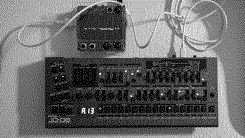

# serialism

I was reading Karlheinz Stockhausen's [How Time Passes](https://sites.evergreen.edu/thewordintheear-fall/wp-content/uploads/sites/316/2014/09/HowTimePasses.pdf) (1957) in *Die Reihe*. So I made this.

## Instuctions

The idea is that each note, clock division, and amplitude is used once per bar. Silly constrain but oh well let's explore it.

- K2 shuffle notes
- K3 shuffle divisions
- E2 transpose ↑/↓

## Requirements

- norns
- MIDI device for output

## Roadmap

- [ ] Maybe gamepad HID composing? Somebody gave me one the other day.
- [ ] Seems like just the thing for n.b.
